# BrickLink Minifigure Manager - Usage Diagram

## System Overview


## Detailed Workflow

### 1. Initial Setup


### 2. Import Process


### 3. Price Fetching with Markup


### 4. Export Process


## Command Examples

### Basic Usage
```bash
# Use default Minifigures.xml file
python main.py

# Specify custom XML file
python main.py --xml inventory.xml

# Show setup instructions
python main.py --setup
```

### Filtering Options
```bash
# Get only new condition prices
python main.py --xml minifigures.xml --condition N

# Get only used condition prices
python main.py --xml minifigures.xml --condition U
```

### Export with Markup
```bash
# Export with default 10% markup
python main.py --xml minifigures.xml --export prices

# Export with custom 15% markup
python main.py --xml minifigures.xml --export prices --markup 15

# Export with 20% markup
python main.py --xml minifigures.xml --export mystore --markup 20
```

### Debug Mode
```bash
# Enable debug output to see API calls
python main.py --xml minifigures.xml --debug
```

## Price Calculation Flow


## File Flow Summary

```mermaid
flowchart LR
    Input["INPUT<br/>📄 Minifigures.xml<br/>(Your inventory)"] --> Script["🔧 main.py<br/>+<br/>🔑 .env"]

    Script --> Out1["OUTPUT<br/>📄 prices.xml<br/>(with markup)"]
    Script --> Out2["OUTPUT<br/>📄 prices.json<br/>(simplified)"]
    Script --> Out3["OUTPUT<br/>📄 prices_detailed.json<br/>(full data)"]

    Out1 --> BL["📤 Upload to<br/>BrickLink Store"]

    style Input fill:#99ccff
    style Script fill:#ffffcc
    style Out1 fill:#ff9999
    style Out2 fill:#99ff99
    style Out3 fill:#e6ccff
    style BL fill:#ffccff
```



## Key Features

### Import
- Read BrickLink XML inventory files
- Extract minifigure data (ID, quantity, condition, color)
- Support for both New (N) and Used (U) conditions

### Price Fetching
- OAuth1 authentication with BrickLink API
- Fetch average prices, min/max ranges
- Automatic fallback from Used to New prices if needed
- Rate limiting (0.1s delay between requests)

### Markup Application
- Configurable markup percentage (default: 10%)
- Applied during export to XML
- Helps calculate selling prices

### Export Formats

| Format | Filename | Purpose | Markup Applied |
|--------|----------|---------|----------------|
| XML | `prices.xml` | BrickLink Mass Upload | ✅ Yes |
| JSON | `prices.json` | Simplified data (minifig, qty, price) | ❌ No (shows original) |
| Detailed JSON | `prices_detailed.json` | Full API response with all price data | ❌ No (shows original) |

## Typical Use Case

1. **Export** your BrickLink inventory as XML
2. **Run script** to fetch current market prices
3. **Apply markup** (10-20%) for profit margin
4. **Export** to BrickLink Mass Upload XML format
5. **Import** back to BrickLink to update store prices automatically

## Notes

- XML export includes markup for direct upload to your store
- JSON exports show original API prices (no markup)
- Markup is only applied in the XML export for BrickLink upload
- Use higher markup for rare/valuable items
- Default 10% markup is a typical reseller margin
